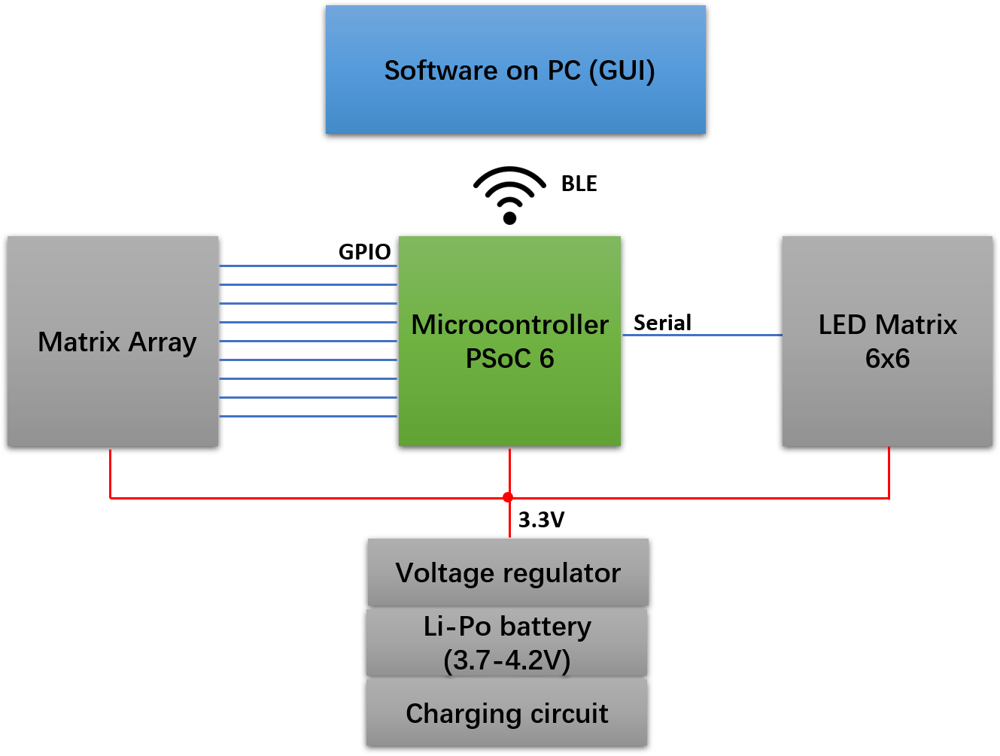
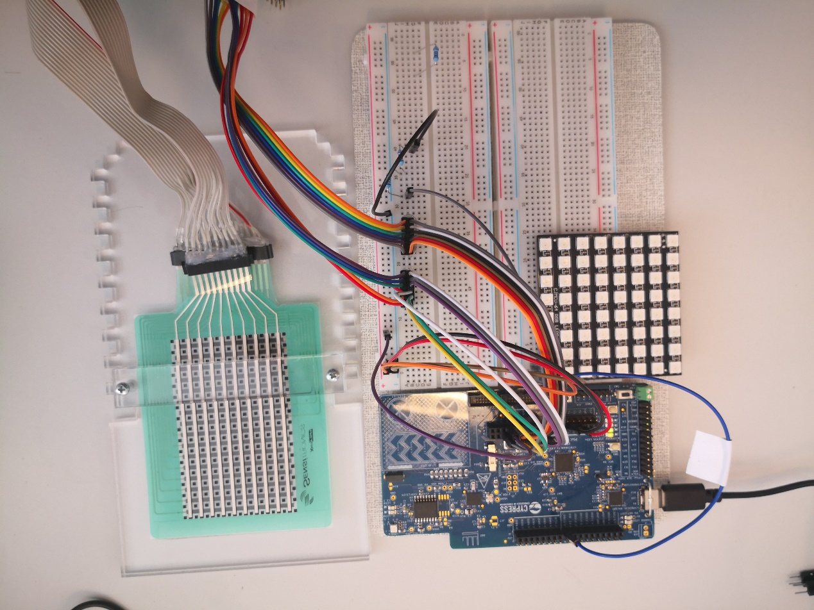
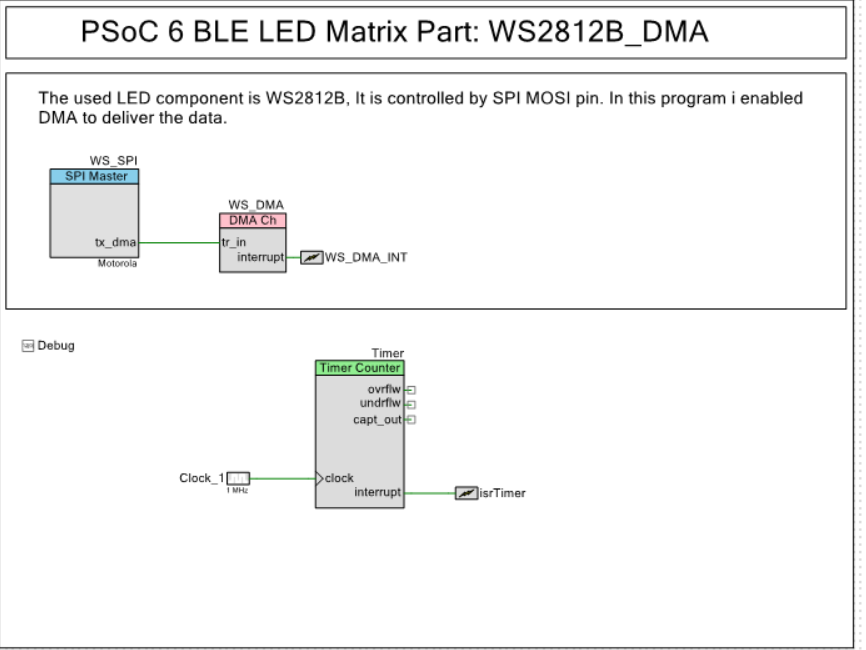
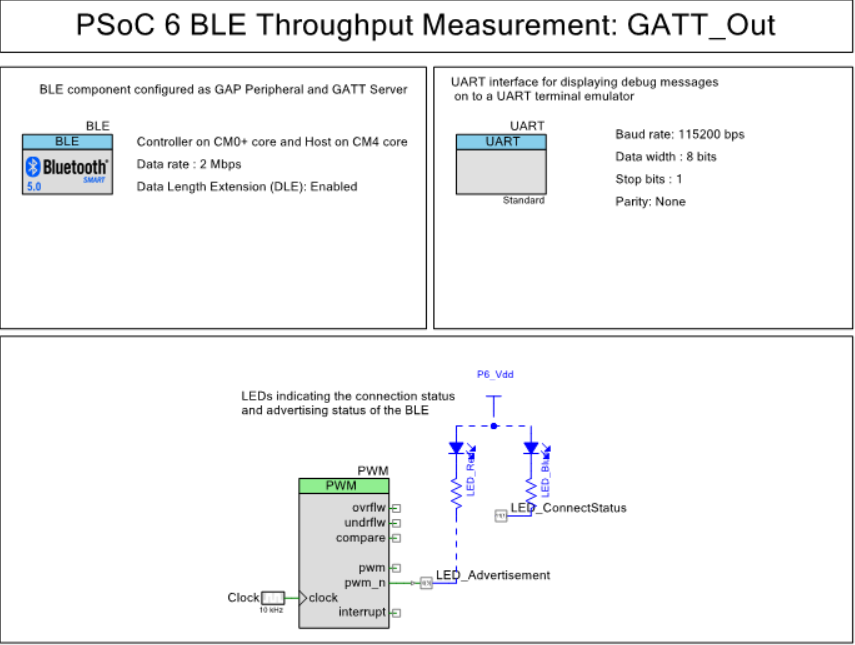
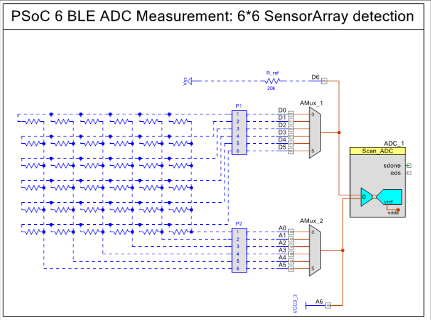
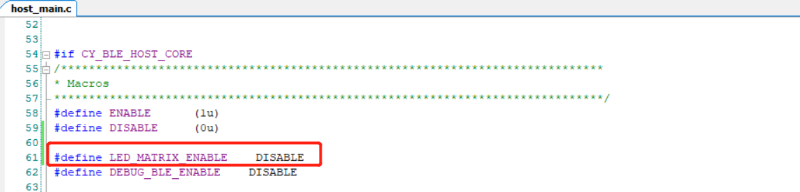

## Intern and Hiwi
This reposity is mainly used to store internship and HIWI-related code, notes, logs and other files. So the mainly works during my intern is to hardware and software development for a wearable device. The structure of my project is shown in figure in the below.

### Hardware
The Hardware of this project consists of three parts:

1.	 LED Matrix: Each LED point corresponds to the one pressure resistor on the SensorArray. So the LED point can use the light and color to show the pressure change. In this project, we defined the cool tone to significant the low pressure(such as blue), high pressure will be represented as the warm tone(red). The brightness are used to show the pressure level.
2.	PSoC microcontroller: PSoC are the MCU in this project, it can collect the data from our SensorArray via ADC function. Then, PSoC will show the pressure change on LED Matrix.
3.	Pressure SensorArray: Our SensorArray is a components which is composed of 6*6 pressure sensor. It can be used as a variable resistor Array. The typical value is 20MΩ.

### Schematic of LED part

### Schematic of BLE part

### Schematic of ADC part

### How to use the LED Matrix?
In order to enable the LED Matrix, we needs to configure the `LED_MATRIX_ENABLE` in host_main.c file as `ENABLE`。

